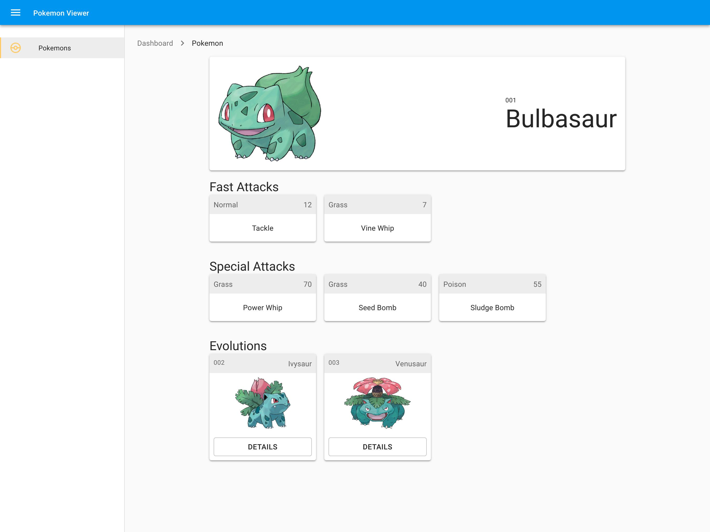

# Catch'em all with GraphQL

This repo is for testing clean ways to fetch data, handle loading cycles, displaying error and structure the code in a way that scales

Feel free to mark any bad code style or help me improve it by contributing. Would really appreciate it!

## Development

```
$ yarn install
$ yarn start
```



